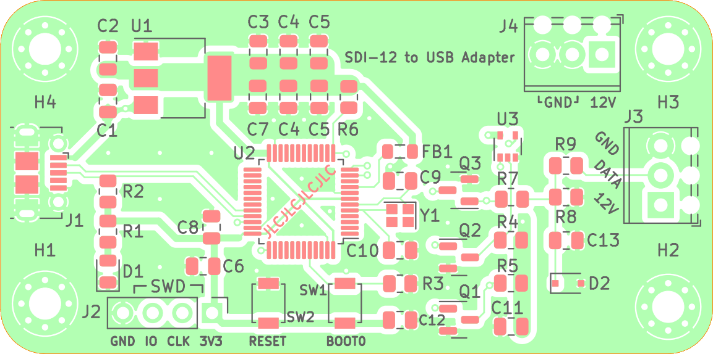
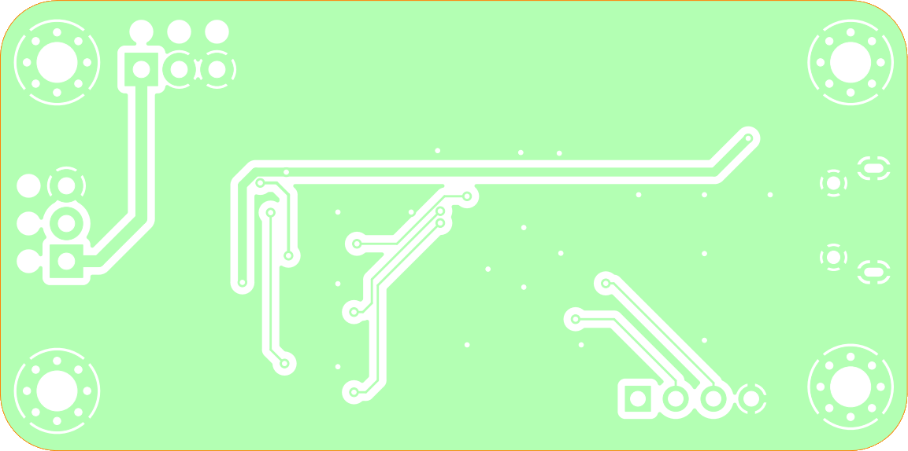
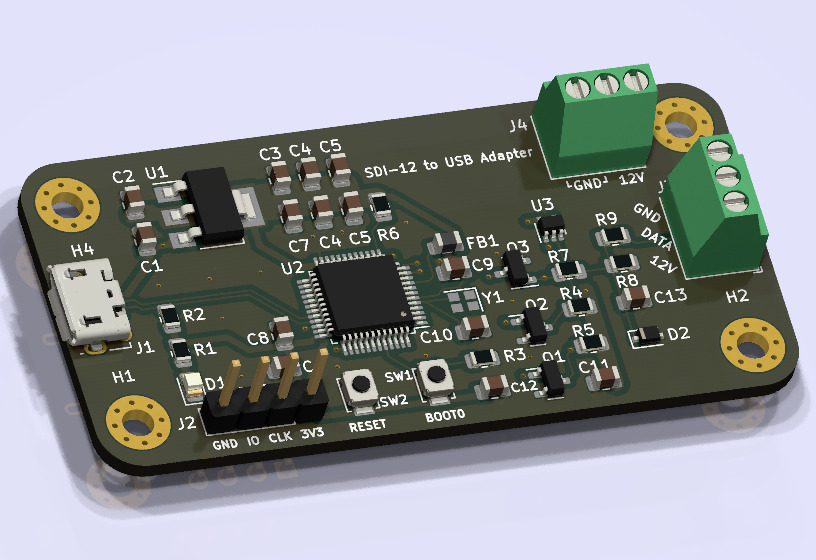
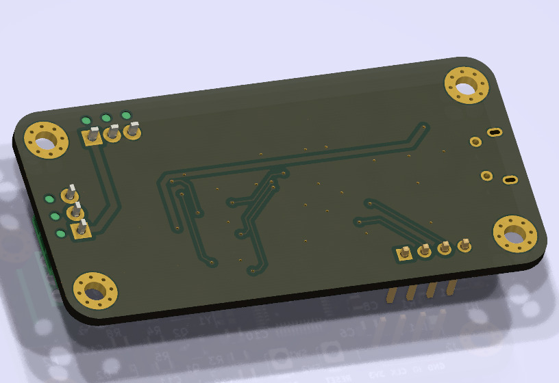

## SDI-12 to USB Type-B Adapter Board PCB
KiCAD project for an adapter powered by a common STM32F103CBT6 series microcontroller chip using the on-chip USB capabilities to communicate with a PC relying on VCOM CDC option, to allow for an easy communication.

The logic voltage shifting and inversion is done using a discrete circuit with transistors and three-state inversing buffer. This ensures compability of SDI standard with TTL logic. All of the parts have been standarized and designated manufacturer is JLCPCB. Project includes index.html as BOM listing. 

## 3D renders

